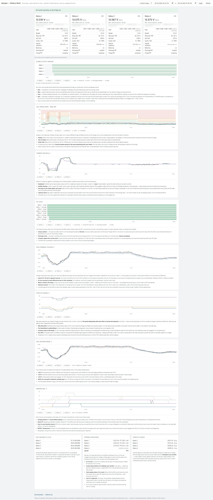

# Marine BMS Monitor

Read-only Bluetooth monitoring for LiTime-family LiFePO₄ battery packs, running on a
Victron Cerbo GX. Logs every pack individually, serves a dashboard, and emails you
when something needs attention.



*The complete dashboard from a running installation — four 320 Ah packs in parallel.
Serials and Bluetooth addresses are blurred; everything else is real data. Every chart
carries a written explanation of what healthy looks like, so the page can be read
correctly by someone who didn't build it.*

---

## What it does, in plain terms

If you have several lithium batteries wired in parallel, your battery monitor sees
them as one big battery. A 500 A shunt reports the bank total — it cannot tell you
that one of your four packs has quietly stopped participating.

That matters more than it sounds. Each pack has its own battery management system
(BMS), a small computer that can disconnect the pack from the bank on its own
initiative — to protect itself, or because someone flipped a switch in the phone app
months ago. When a pack drops out, the others silently carry its share. Nothing
alarms. Your shunt still shows a healthy bank. You find out when you're anchored out
and the capacity isn't there.

This software talks to each pack's BMS directly over Bluetooth, stores what it finds,
and shows you the bank as four separate batteries rather than one. It reports
per-pack voltage, current, individual cell voltages, two temperatures, state of
charge, cycle count, and the internal switch states that determine whether a pack is
actually connected.

**It is strictly read-only.** It cannot change charge settings, cannot influence your
inverter or solar controllers, and registers nothing on Victron's internal
communication bus. Its worst failure mode is telling you nothing.

## Why it was built

On the boat this was written for, one pack sat electrically isolated from the bank for
two days. Its cells were healthy, its temperatures normal, its phone app showed green
across the board, and the BMS reported no fault of any kind. It simply wasn't
contributing. A 100 A load test confirmed it: three packs accounted for the entire
bank current, and the fourth supplied nothing.

Nothing in the standard Victron or manufacturer tooling would have shown that. What
gave it away was a chart of four lines where one had gone flat.

The fix turned out to be a full power cycle of that pack — its state was held in
volatile memory, so toggling switches in the app did nothing. Without per-pack
monitoring there would have been no reason to suspect it, and no way to confirm the
fix.

## What you get

- **A live dashboard** in any browser on the boat network: per-pack cards, and charts
  of cell balance, current sharing, state of charge, voltage, temperature, and
  internal switch state. Every chart carries a written explanation of what healthy
  looks like and what to worry about, so a guest or a future owner can read it
  correctly without asking you.
- **Email alerts**, checked every 15 minutes: a pack disconnected, a BMS protection
  trip, cells outside safe voltage, charging below freezing, packs not reporting —
  and, crucially, an alert if the monitoring itself stops working.
- **A database** of every reading, kept 30 days in full detail and summarised forever,
  so you can answer "was this getting worse, or has it always been like that?"
- **A JSON feed** suitable for piping into Node-RED, Home Assistant, or an automated
  daily report.

Storage is roughly 2 MB per day. It runs comfortably on a Cerbo GX alongside
everything else.

---

## What you need

| | |
|---|---|
| **Batteries** | LiTime, Redodo or Power Queen LiFePO₄ with the Bluetooth BMS — the ones whose app shows individual cell voltages. See *Other manufacturers* below. |
| **Host** | A Victron Cerbo GX (or GX-family device) running Venus OS **Large**, with root SSH access enabled. |
| **Bluetooth** | The GX device's built-in adapter, or a USB dongle. Packs must be within range — a few metres through a bulkhead is typically fine. |
| **Network** | The GX on your boat network. Wired Ethernet strongly preferred (see below). |
| **Software** | Nothing to install. Uses only what Venus OS already ships. |

### Two things to check before you start

**Wi-Fi and Bluetooth share one radio** on the Cerbo. If your GX is on Wi-Fi, expect
noticeably worse Bluetooth reliability — the two compete for the same antenna. Wired
Ethernet frees the radio for this.

**Victron's own Bluetooth must be off.** In *Settings → Connectivity*, "Bluetooth (for
VictronConnect App)" reconnects roughly every minute and takes the adapter away from
this software. Turning it off does **not** affect your MPPTs, SmartShunt or Orions —
each of those has its own radio.

Also worth knowing: each BMS accepts **one Bluetooth client at a time**. If the
manufacturer's phone app is open and connected to a pack, this software cannot reach
that pack, and vice versa.

---

## Installing

Copy the files to the GX device:

```
scp bms_service.py litime_bluez.py dashboard.html documentation.html \
    bmsq install.sh root@<gx-ip>:/data/bms/
```

Everything lives under `/data`, which survives Venus OS firmware updates.

Find your packs:

```
cd /data/bms
python3 litime_bluez.py --scan
```

Packs advertise as something like `L-12320BNN130-B02290`. Note each MAC address, and
work out which physical battery is which — **the BMS does not store its serial
number**, so the only way to map a Bluetooth address to a battery in your locker is
to read the label. Get this right now; it is tedious to redo later.

Create `/data/bms/packs.json`:

```json
{
  "AA:BB:CC:DD:EE:01": { "label": "Battery 1", "serial": "<from the label>" },
  "AA:BB:CC:DD:EE:02": { "label": "Battery 2", "serial": "<from the label>" }
}
```

Confirm one pack reads before going further:

```
python3 litime_bluez.py --address AA:BB:CC:DD:EE:01 --count 3
```

You should see plausible voltage, cell voltages and temperature. If so:

```
sh /data/bms/install.sh
```

That registers it as a supervised service that starts at boot and restarts if it
crashes. The dashboard is then at `http://<gx-ip>:8088/`.

For email alerts, import `bms-alerts-flow.json` into Node-RED as a new flow and enter
your mail password in the email node. Full detail is in `documentation.html`, which is
also served at `/docs` once running.

### Reasonable expectations

Bluetooth in a metal boat full of 2.4 GHz devices is not perfectly reliable. Around
95% of polls succeeding is normal and entirely adequate — you are sampling every two
minutes, so an occasional miss costs nothing. If one pack sits far below its siblings,
that is signal or interference, not a battery fault.

---

## Other manufacturers

### Almost certainly works as-is

**Redodo** and **Power Queen** packs use the same BLE protocol. Both are made in the
same factories as LiTime, advertise the same service UUID, and respond to the same
commands. Two independent projects
([litime-ble-hacs](https://github.com/rubenmuehlhans/litime-ble-hacs),
[Litime_BMS_ESP32](https://github.com/mirosieber/Litime_BMS_ESP32)) report all three
brands working against one implementation.

Run `--scan`. If your packs appear and `--count 3` returns sensible numbers, you're
done — no code changes needed.

The scan filters on a LiTime hardware prefix; if your packs don't appear but you can
see them in `bluetoothctl`, adjust `LITIME_OUI` near the top of `litime_bluez.py`, or
pass the MAC directly with `--address`, which skips the filter entirely.

### Needs the decoder rewritten, but the rest is reusable

**JBD, Daly, JK, Seplos** and similar BMS use completely different frame formats. The
Bluetooth transport layer, database, dashboard, alerting and service plumbing all
still apply — only `decode_status()` in `litime_bluez.py` and the request frame need
replacing.

These protocols are already documented in
[dbus-serialbattery](https://github.com/mr-manuel/venus-os_dbus-serialbattery), which
supports many of them. Lifting the byte layout from there into this decoder is a
reasonable afternoon's work for anyone comfortable with Python.

You'll need to change: the service and characteristic UUIDs, the request frame, the
byte offsets in `decode_status()`, and the frame reassembly if your BMS uses a
different length convention.

### Won't work

Packs with no Bluetooth, or with a closed encrypted protocol. If the manufacturer's
app can show you individual cell voltages, the data exists and is probably reachable;
if the app only shows a percentage and a green tick, there may be nothing more to get.

### If you adapt it

Two things are worth knowing before you trust your own numbers.

**Validate against your shunt.** During real charging, the sum of your packs' reported
currents should match what your battery monitor sees. If it doesn't, your decode is
wrong somewhere — this is the single most valuable check you can run, and it caught a
misinterpretation during development here.

**Every BMS has a current deadband.** These packs cannot measure below about 2 A and
report exactly zero instead. A pack showing 0.0 A is saying "less than 2 A", not
"disconnected" — and conflating the two will send you chasing a fault that isn't
there. Find your own threshold by looking at the smallest non-zero current you ever
record.

---

## Known limits

This has run on exactly one boat, against four packs of one model on one firmware
version. It is honest, working software rather than a polished product.

Specifically:

- **The BMS protection bit definitions are inherited and unvalidated.** No protection
  event has ever occurred on this installation, so while the field decodes cleanly and
  reads zero when healthy, which bit means "over-temperature" versus "over-current" is
  unproven. Treat any non-zero value as "something tripped, go look" rather than
  trusting the label.
- **Per-pack state of charge is unreliable** and the packs will disagree with each
  other, sometimes wildly. This is expected — they are independent counters accumulating
  independent errors, and the deadband above means small loads go uncounted. Your shunt
  remains authoritative. The dashboard explains this where it's displayed.
- **Terminal voltages are not comparable between packs.** Each BMS has its own
  calibration offset of 40–100 mV. Compare cell sums instead; those agree closely.
- **Venus OS specific** in its packaging, though the core is plain Python with no
  dependencies beyond what any Linux system with BlueZ provides.

## Credits

The BLE protocol was originally reverse-engineered by
[calledit/LiTime_BMS_bluetooth](https://github.com/calledit/LiTime_BMS_bluetooth),
then verified here against several thousand captured frames and extended with fields
that project didn't cover. Protocol reference for other manufacturers comes from
[mr-manuel/venus-os_dbus-serialbattery](https://github.com/mr-manuel/venus-os_dbus-serialbattery).

## A caution

This monitors. It does not control, and it should not be adapted to control without a
great deal more care than went into this. An earlier attempt on this boat used a
driver that *did* register as a controlling BMS; when its Bluetooth connection
dropped, all three solar controllers latched a "no BMS" error and stopped charging
entirely — and clearing that required connecting to each controller individually with
a laptop. Read-only is a feature.

Nothing here is a substitute for a correctly specified and installed battery system.
It tells you what your batteries are doing. It does not make them safe.
